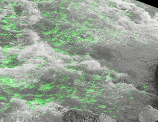

# AWIVE Configurator
The AWIVE configurator is a software used to analyze images in order to
determine the configuration used for the [awive](https://github.com/JosephPenaQuino/adaptive-water-image-velocimetry-estimator)
project.


[[_TOC_]]

## Getting Started

### Prerequisites

This software was tested in:

- Linux host computer (ubuntu 22.04)
- Python 3.11.2

### Installation

If you are using pyenv and poetry, execute the commands below:

```
pyenv local 3.11.2
poetry install
```

Otherwise, excute these commands:

```
python -m venv venv
source venv/bin/activate
python -m pip install .
```

## Usage

The awive configurator have the following features:

- image analyzer
- AWIVE runner

Before attempting to use any feature, crete your own configuration file:

```
cp config.example.json config.json
```

### Image Analyzer


In order run the image analyzer, you require the following:

- The path of the video to be analyzed
- The path where to save frames extracted from the video

Firstly, set both previous paths in the `config.json` in the keys
`dataset.video_path` and `dataset.image_dataset` respectively.

Then, execute the command below to just visualize a frame from the video:

```
python -m awivec.analyze_image config.json -P
```

Then, checkout how the image looks with the awive pre-processing, perhaps the
default configuration might generate an unusable image. Edit the keys of
`preprocessing` in the `config.json` file.

```
python -m awivec.analyze_image config.json -P -u -r
```

As a suggestion, begin by calibrating the `processing.pre_roi` to define only
the area of interest. Next, use `preprocessing.rotate_image` to adjust until
the direction of the river aligns with 0 degrees, making it a horizontal line.
Finally, modify the `preprocessing.roi` key to encompass only the water in the
image.

### AWIVE Runner

When the `config.json` file is ready, run the command below:

```bash
python -m awivec.run_awive config.json -v
```

Then, a video like the one shown below should be displayed.

<center>
    
</center>


## Roadmap

TODOs to version v0.2.0:

- [ ] Add steps to configure orthorectification

TODOs to version v1.0.0:

- [ ] Implement a Graphic User Interface
